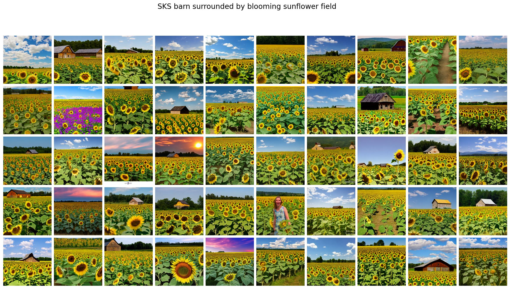
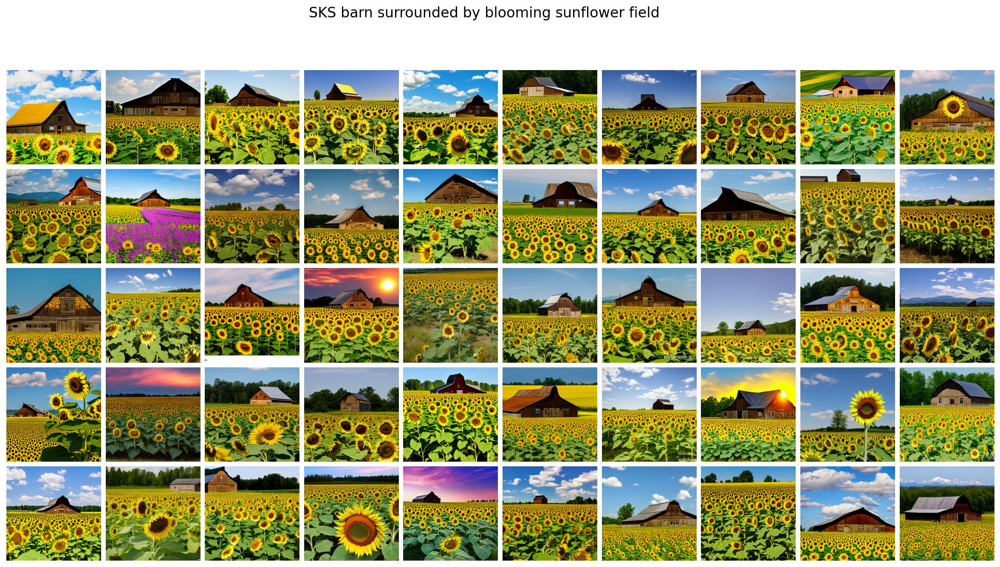

# TEA (Test-time Embedding Adjustment) Integration Guide

## Overview

This is a guide to integrate TEA into the ClassDiffusion pipeline. For installing ClassDiffusion, please refer to the [ClassDiffusion README](https://github.com/Rbrq03/ClassDiffusion).

TEA (Test-time Embedding Adjustment) is a technique that improves subject personalization by adjusting text embeddings at inference time. It works by interpolating between the original prompt embeddings and target prompt embeddings using spherical linear interpolation (SLERP) and norm adjustment.

The qualitative results can be found in the `evaluation_demo` folder. 



*ClassDiffusion. Failure cases - no barn in the image but just sunflower field.*

 
*Results with TEA. TEA can significantly mitigate the failure cases.*

## Reproduce the results 

The first step is to install ClassDiffusion. Please refer to the [ClassDiffusion README](https://github.com/Rbrq03/ClassDiffusion).
Please note that the `ClassDiffusion` requires a specific version of `diffusers` to be installed. Please refer to the [ClassDiffusion README](https://github.com/Rbrq03/ClassDiffusion) and the requirements.txt file.

To get the pretrained model, run the following command:

```bash
bash scripts/train_single.sh
```

To gen the output images with ClassDiffusion and ClassDiffusion+TEA, run the following command:

```bash
bash scripts/gen.sh
bash scripts/gen_tea.sh
```

To evaluate and get the alignment scores, run the following command:

```bash
python scripts/eval.py
python scripts/eval_tea.py
```

The training data can be found in the `cs101` folder, and the prompts can be found in the `prompts` folder.