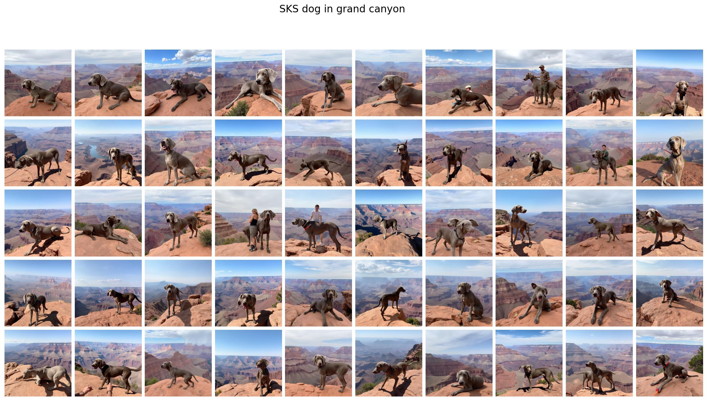
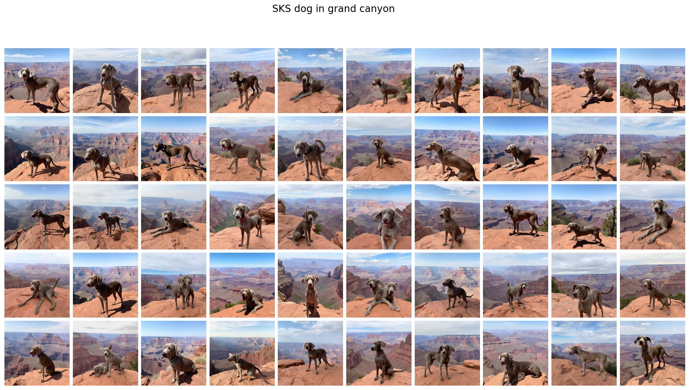
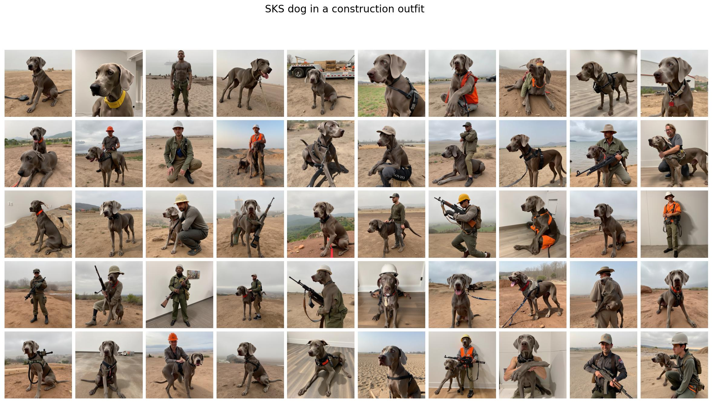
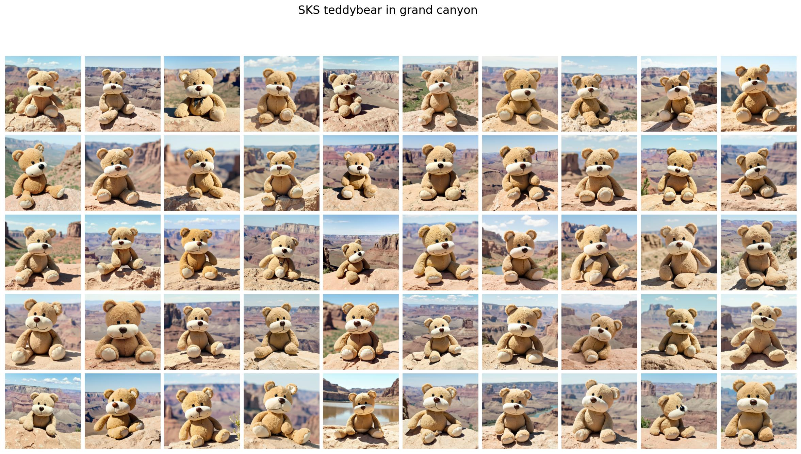
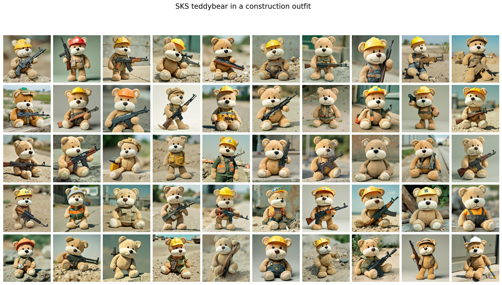

# TEA (Test-time Embedding Adjustment) Integration Guide

## Overview

This is a guide to integrate TEA into the EasyControl pipeline. For installing EasyControl, please refer to the [EasyControl README](https://github.com/Xiaojiu-z/EasyControl/tree/main).

TEA (Test-time Embedding Adjustment) is a technique that improves subject personalization by adjusting text embeddings at inference time. It works by interpolating between the original prompt embeddings and target prompt embeddings using spherical linear interpolation (SLERP) and norm adjustment.

The qualitative results can be found in the `evaluation_demo` folder. 



*Results without TEA: Subject personalization using standard EasyControl pipeline*

 
*Results with TEA: Enhanced subject personalization using Test-time Embedding Adjustment*


*Results without TEA: Subject personalization using standard EasyControl pipeline*

 
*Results with TEA: Enhanced subject personalization using Test-time Embedding Adjustment*


*Results without TEA: Subject personalization using standard EasyControl pipeline*

 
*Results with TEA: Enhanced subject personalization using Test-time Embedding Adjustment*


*Results without TEA: Subject personalization using standard EasyControl pipeline*

 
*Results with TEA: Enhanced subject personalization using Test-time Embedding Adjustment*

## Reproduce the results 

After installing EasyControl, you can reproduce the results by running the following commands:

```bash
bash train_cs101_pet_dog_1.sh
bash train_cs101_plushie_teddybear.sh
```

The script includes the training script to obtain the trained personalization model `subject control` setting. 
The script also includes the inference script to generate the images with the trained personalization model and the TEA-enabled pipeline (see `infer_subject_with_tea.py` and `src/pipeline_with_tea.py`).
The results have been run on A100 80G GPU. 

The training data is from the CS101 dataset, that can be found in the `cs101` folder, with the corresponding `jsonl` file in the `cs101` folder. 

The `jsonl` file is in the following format:

```json
{"source": "./cs101/pet_dog1/0.jpeg", "caption": "A SKS wearing a teal harness and leash, standing on a rocky outcrop overlooking a vast, green mountainous landscape.", "target": "./cs101/pet_dog1/1.jpeg"}
```

Where `source` is the subject image, `caption` is the original prompt, and `target` is the target image. 

The inference prompt file can be found in the `prompts` folder. 

## Core Concept

TEA addresses the challenge of subject personalization by:
1. **Direction Adjustment**: Using SLERP to smoothly interpolate between prompt directions
2. **Magnitude Control**: Adjusting embedding norms to balance between original and target characteristics
3. **Test-time Adaptation**: No additional training required - works at inference time

## Key Components

### 1. TEA Algorithm Functions (`tea.py`)

The core TEA functions include:

```python
def slerp_batched(vector_to_project, target_vector, rho):
    """Spherical linear interpolation for batched tensors"""
    # Interpolates between vector_to_project and target_vector
    # rho=0: returns vector_to_project unchanged
    # rho=1: returns target_vector

def adjust_norm_and_slerp_3d(vector_to_project, target_vector, rho, alpha):
    """Combined norm adjustment and SLERP for 3D tensors"""
    # alpha controls norm blending (0=original norm, 1=target norm)
    # rho controls direction blending (0=original direction, 1=target direction
```

### 2. Modified Pipeline (`pipeline_with_tea.py`)

The key modification is in the `encode_prompt` method:

```python
def encode_prompt(
    self,
    prompt: Union[str, List[str]],
    target_prompt: Union[str, List[str]],  # NEW: Target prompt for TEA
    prompt_2: Union[str, List[str]],
    device: Optional[torch.device] = None,
    num_images_per_prompt: int = 1,
    prompt_embeds: Optional[torch.FloatTensor] = None,
    pooled_prompt_embeds: Optional[torch.FloatTensor] = None,
    max_sequence_length: int = 512,
    lora_scale: Optional[float] = None,
    rho: float = 0.2,          # NEW: SLERP interpolation factor
    alpha: float = 0.5,        # NEW: Norm adjustment factor
):
```

## Integration Steps

### Step 1: Copy TEA Files

Copy the following files to your project:
- `tea.py` - Core TEA algorithms
- `pipeline_with_tea.py` - TEA-enabled pipeline
- `infer_subject_with_tea.py` - Example inference script

### Step 2: Understanding TEA Parameters

#### `rho` (Direction Interpolation Factor)
- **Range**: 0.0 to 1.0
- **Purpose**: Controls how much to blend towards the target prompt direction
- **Values**:
  - `rho = 0.0`: Use original prompt direction only
  - `rho = 0.2`: Slight adjustment towards target (recommended starting point)
  - `rho = 1.0`: Use target prompt direction completely

#### `alpha` (Norm Adjustment Factor)  
- **Range**: 0.0 to 1.0 (can exceed 1.0 for amplification)
- **Purpose**: Controls magnitude blending between original and target embeddings
- **Values**:
  - `alpha = 0.0`: Keep original embedding magnitude
  - `alpha = 0.5`: Balance between original and target magnitudes (recommended)
  - `alpha = 1.0`: Use target embedding magnitude

### Step 3: Modify Your Inference Script

Replace the standard `FluxPipeline` import with the TEA-enabled version:

```python
# OLD
from src.pipeline import FluxPipeline

# NEW  
from src.pipeline_with_tea import FluxPipeline
```

### Step 4: Update Pipeline Call

Add TEA parameters to your pipeline call:

```python
# Example: Transform "An SKS dog" to look more like "A golden retriever"
pipeline_args = {
    "prompt": "An SKS dog in the park",           # Original prompt with subject token
    "target_prompt": "A golden retriever in the park",  # Target prompt with desired characteristics
    "spatial_images": [],
    "subject_images": subject_images,
    "height": 768,
    "width": 768,
    "cond_size": 384,
    "guidance_scale": 3,
    "num_inference_steps": 20,
    "max_sequence_length": 512,
    "rho": 0.2,        # Interpolation factor
    "alpha": 0.5,      # Norm adjustment factor
}

image = pipeline(**pipeline_args).images[0]
```

## TEA Algorithm Deep Dive

### How TEA Works

1. **Dual Embedding Generation**:
   ```python
   # Generate embeddings for both prompts
   pooled_prompt_embeds = self._get_clip_prompt_embeds(prompt=prompt, ...)
   pooled_target_prompt_embeds = self._get_clip_prompt_embeds(prompt=target_prompt, ...)
   ```

2. **TEA Adjustment**:
   ```python
   # Apply TEA adjustment
   pooled_prompt_embeds = adjust_norm_and_slerp_3d(
       pooled_prompt_embeds, 
       pooled_target_prompt_embeds, 
       rho, 
       alpha
   )
   ```

3. **Embedding Processing**:
   - **Norm Adjustment**: Blends the magnitudes of original and target embeddings
   - **SLERP**: Spherically interpolates between embedding directions
   - **Output**: Adjusted embeddings that retain subject identity while incorporating target characteristics
