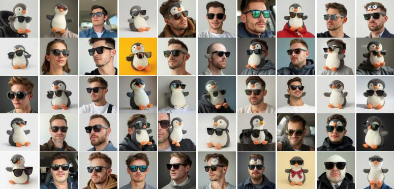
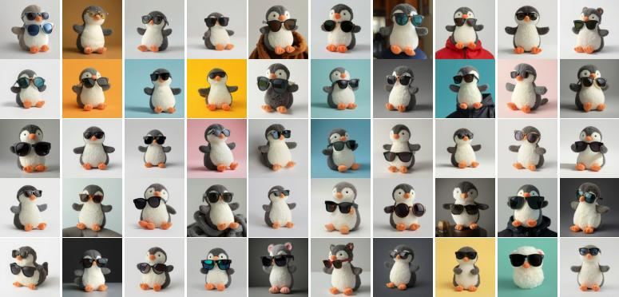
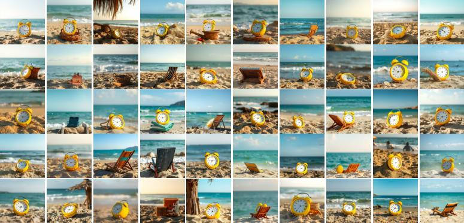
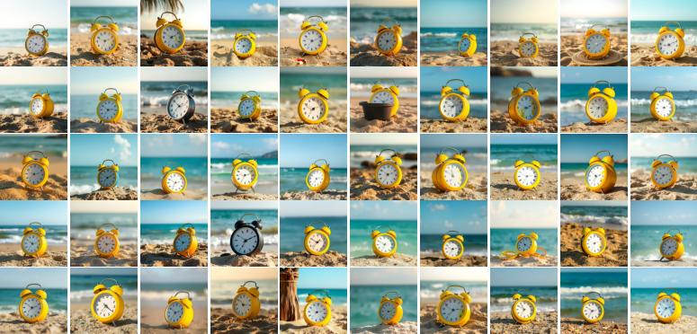

# OminiControl with TEA

This is a guide to integrate TEA into the OminiControl pipeline. For installing OminiControl, please refer to the [OminiControl README](https://github.com/Yuanshi/OminiControl).

TEA (Test-time Embedding Adjustment) is a technique that improves subject personalization by adjusting text embeddings at inference time. It works by interpolating between the original prompt embeddings and target prompt embeddings using spherical linear interpolation (SLERP) and norm adjustment.

The qualitative results can be found in the `evaluation_demo` folder. 


*Results without TEA: Subject personalization using standard OminiControl pipeline*

 
*Results with TEA: Enhanced subject personalization using Test-time Embedding Adjustment*


*Results without TEA: Subject personalization using standard OminiControl pipeline*


*Results with TEA: Enhanced subject personalization using Test-time Embedding Adjustment*


*Results without TEA: Subject personalization using standard OminiControl pipeline*


*Results with TEA: Enhanced subject personalization using Test-time Embedding Adjustment*

## Reproduce the results 

After installing OminiControl, you can reproduce the results by running the following commands:

```bash
bash scripts/run_gen.sh # To generate the images with the standard OminiControl pipeline
bash scripts/eval_omini.sh # To evaluate the images with the CLIP and DINO alignment scores
bash scripts/eval_openai.sh # To evaluate the images with the VLM as a judge scores
```

The scripts include the following new files (compared to the original OminiControl pipeline):

- `example_subject_full.py`: To generate the images with the standard OminiControl pipeline
- `example_subject_tea.py`: To generate the images with the TEA-enabled OminiControl pipeline
- `omini/pipeline/flux_omini_with_tea.py`: Define the TEA-enabled OminiControl pipeline
- `investigate_clip_sim_image.py`: To evaluate the images with the CLIP and DINO alignment scores
- `investigate_dino_sim_image.py`: To evaluate the images with the DINO alignment scores
- `investigate_clip_sim_v2.py`: To evaluate the images with the CLIP alignment scores
- `eval_openai.py`: To evaluate the images with the VLM as a judge scores

