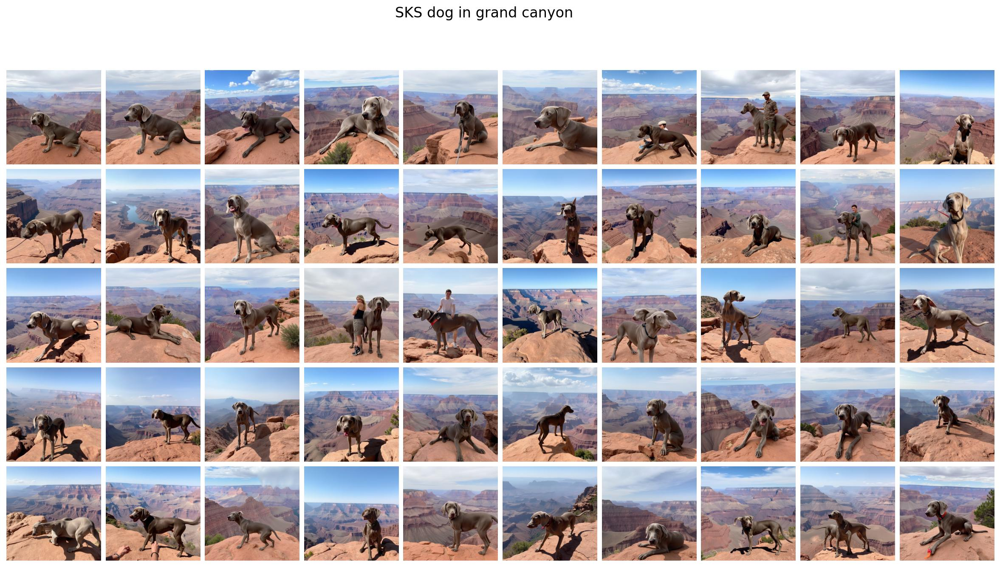
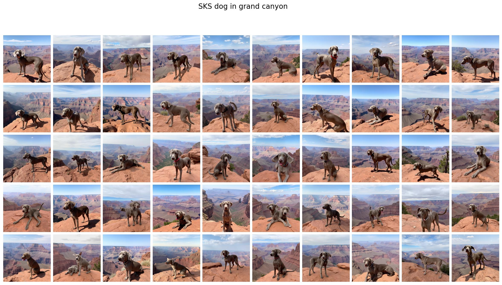
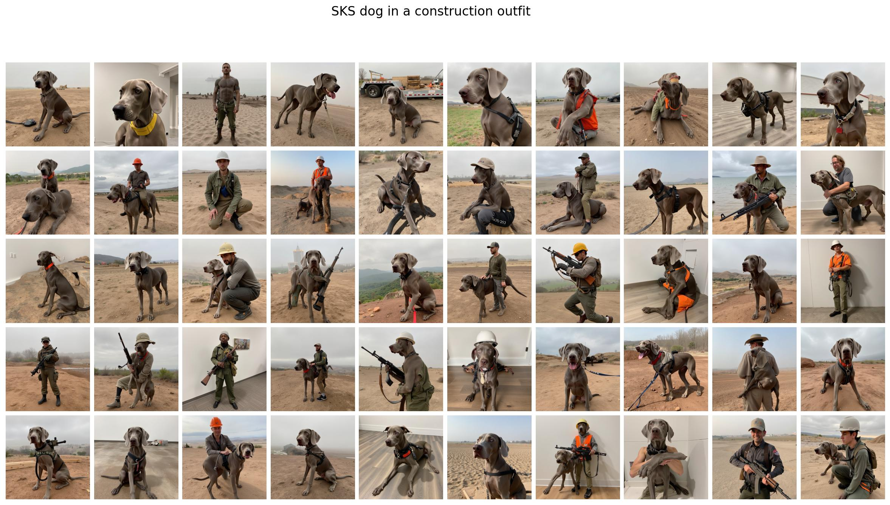
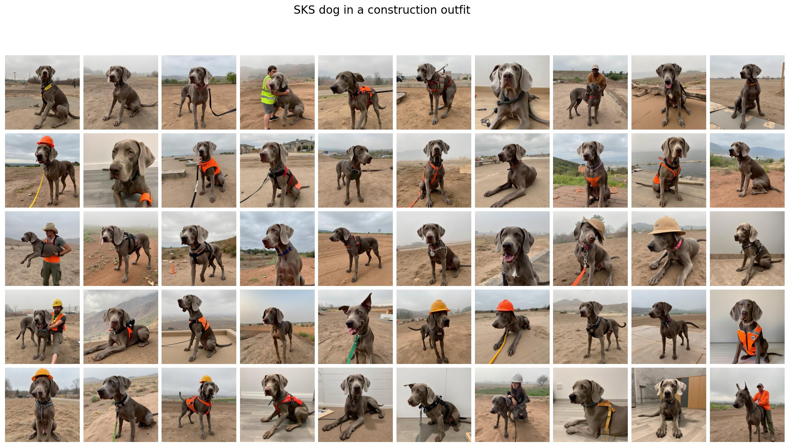
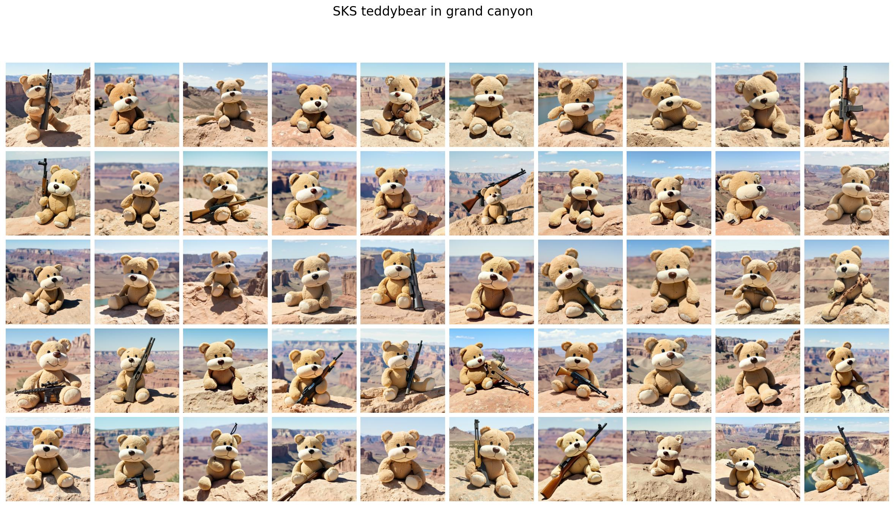
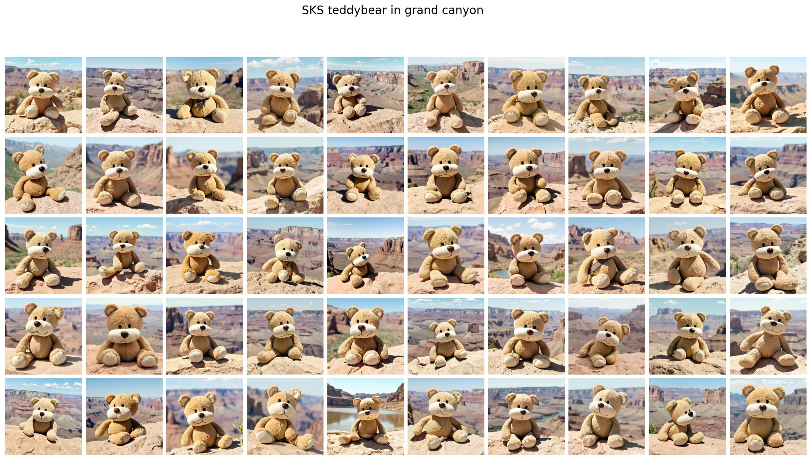
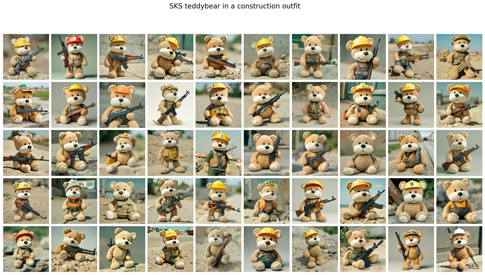
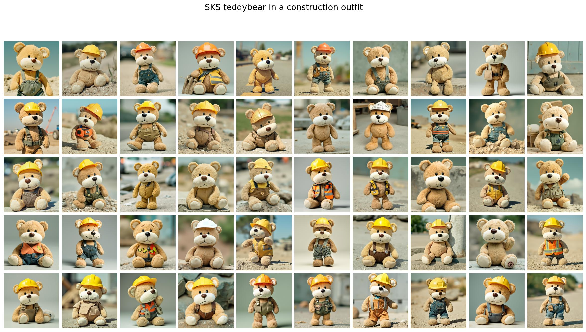

# Embedding-Adjustment

This is the code and data for the paper "Mitigating Semantic Collapse in Generative Personalization with a Surprisingly Simple Test-Time Embedding Adjustment". This repository provides: 

- The code to train a personalized model with Textual Inversion (TI), Dreambooth, and Custom Diffusion.
- The code to generate personalized images with the pretrained personalized models.
- Our proposed method: Test-Time Embedding Adjustment (TEA) to generate personalized images with the pretrained models (mitigating the Semantic Collapse Problem on the fly).
- The code to investigate the Semantic Collapse Problem and evaluate the performance of TEA and other baselines (generated images).

*Update (July 2025): Our method is now integrated into EasyControl and ReVersion. Please refer to the EasyControl and ReVersion subfolders for: how to install and reproduce the results.*

*Update (August 2025): Our method is now integrated into ClassDiffusion.*

## Qualitative Results

Example results of the proposed method (TEA) and the baselines (EasyControl and ReVersion) are shown below. More results can be found in the `EasyControl`, `ReVersion`, and `ClassDiffusion` subfolders. 

It can be seen that the proposed method (TEA) can significantly improve the prompt alignment of the generated images. For example, in the case of ReVersion, with the prompt "cat carved by carrot in the garden", the standard ReVersion generates some failure cases where the cat is not carved by carrot or only shows the carrot. In the case of EasyControl, without the keyword "gun", but the generated images still contain a gun concept. With our TEA method, the above failure cases are mitigated. 

### EasyControl with TEA 


*EasyControl: Subject personalization using standard EasyControl pipeline.* Failure cases - dog stands beside a person.

 
*EasyControl with TEA: Enhanced subject personalization using Test-time Embedding Adjustment*


*EasyControl: Subject personalization using standard EasyControl pipeline.* Failure cases - holding gun LOL, or dog stands beside a person.

 
*EasyControl with TEA: Enhanced subject personalization using Test-time Embedding Adjustment*


*EasyControl: Subject personalization using standard EasyControl pipeline.* Failure cases - holding gun again LOL.

 
*EasyControl with TEA: Enhanced subject personalization using Test-time Embedding Adjustment*


*EasyControl: Subject personalization using standard EasyControl pipeline.* Failure cases - holding gun again LOL.

 
*EasyControl with TEA: Enhanced subject personalization using Test-time Embedding Adjustment*

### ReVersion with TEA 


*ReVersion: Cat carved by carrot in the garden.* Failure cases - the cat is not carved by the carrot or only shows the carrot.


*ReVersion with TEA: Cat carved by carrot in the garden*


*ReVersion: Dog carved by paper in the library.* Failure cases - the dog is not carved by the paper but attached a paper to the dog LOL.


*ReVersion with TEA: Dog carved by paper in the library*

## Requirements

We provide the requirements.txt file for the dependencies. Some notable dependencies are:

```
diffusers==0.33.0.dev0
ftfy
tensorboard
Jinja2
peft==0.7.0
clip-retrieval
transformers>=4.25.1
torchvision
torchmetrics==1.7.1
```

## Data

We provide a subset of the CelebA (10 identities) and CustomConcept 101 (9 concepts) that we used in the paper for your convenience. The full dataset is available at [CelebA](https://github.com/ndb796/LatentHSJA?tab=readme-ov-file) and [CustomConcept 101](https://www.cs.cmu.edu/~custom-diffusion/assets/data.zip).

## Training Personalized Models

We provide the code to generate scripts for training and testing in the notebook `generate_scripts.ipynb` that can be scaled to larger datasets. The scripts are saved in the `scripts` folder. For example, below is the script to train Textual Inversion (TI) on the CelebA (124 identities) dataset.

```
CUDA_VISIBLE_DEVICES=0 accelerate launch --num_processes=1 textual_inversion.py \
  --pretrained_model_name_or_path="stable-diffusion-v1-5/stable-diffusion-v1-5" \
  --train_data_dir="celebA/124" \
  --learnable_property="object" \
  --placeholder_token="<man>" --initializer_token="man" \
  --resolution=512 \
  --train_batch_size=1 \
  --gradient_accumulation_steps=1 \
  --max_train_steps=3000 \
  --learning_rate=5.0e-04 --scale_lr \
  --lr_scheduler="constant" \
  --lr_warmup_steps=0 \
  --output_dir="outputs/celebA_ti_124" \
  --validation_steps=100 \
  --save_steps=100 \
  --checkpointing_steps=10000 \
  --mixed_precision="no" \
  --validation_prompt="a photo of a <man> wearing glasses and writing on a red notebook"
```

Training a Dreambooth model with LoRA as below: 

```
CUDA_VISIBLE_DEVICES=1 accelerate launch --num_processes=1 --main_process_port=29503 train_dreambooth_lora.py \
    --pretrained_model_name_or_path="stable-diffusion-v1-5/stable-diffusion-v1-5"  \
    --instance_data_dir="celebA/124" \
    --class_data_dir="./evaluation_folder/prior_images/male" \
    --output_dir="outputs/celebA_db_lora_rank4_124" \
    --with_prior_preservation --prior_loss_weight=1.0 \
    --instance_prompt="sks man" \
    --class_prompt="a photo of a man" \
    --resolution=512 \
    --train_batch_size=1 \
    --gradient_accumulation_steps=1 \
    --learning_rate=1e-4 \
    --lr_scheduler="constant" \
    --lr_warmup_steps=0 \
    --num_class_images=200 \
    --max_train_steps=3000 \
    --checkpointing_steps=50 \
    --validation_prompt="a photo of a sks man wearing glasses and writing on a red notebook" \
    --validation_steps=50 \
    --rank=4 \
```

Training a Custom Diffusion model with LoRA as below: 

```
CUDA_VISIBLE_DEVICES=2 accelerate launch --num_processes=1 --main_process_port=29501 train_custom_diffusion_and_eval.py \
    --pretrained_model_name_or_path="stable-diffusion-v1-5/stable-diffusion-v1-5" \
    --instance_data_dir="celebA/124" \
    --output_dir="outputs/celebA_custom_diffusion_124" \
    --class_data_dir="./evaluation_folder/prior_images/male" \
    --with_prior_preservation --prior_loss_weight=1.0 \
    --class_prompt="a photo of a man" --num_class_images=200 \
    --instance_prompt="photo of a <man> man" \
    --resolution=512 \
    --train_batch_size=1 \
    --learning_rate=5e-6 \
    --lr_warmup_steps=0 \
    --max_train_steps=2000 \
    --scale_lr --hflip --noaug \
    --freeze_model crossattn \
    --modifier_token "<man>" \
    --enable_xformers_memory_efficient_attention \
    --checkpointing_steps=100 \
    --validation_prompt="photo of a <man> man wearing glasses and writing on a red notebook" \
    --validation_steps=50 \
    --no_safe_serialization\
    --eval_steps="1000"\
    --target_name="man"\
    --rho=0.2\
    --alpha=0.5\
    --output_images_dir="evaluation_massive/celebA_custom_diffusion_124"\
    --output_images_dir_ea="evaluation_massive/celebA_custom_diffusion_124_adjust_embedding_v4/rho0.2_alpha0.5"\
    --prompt_file="prompts/gen_prompt_actions.csv"\
    --num_inference_steps=50\
    --guidance_scale=7.0\
    --num_images=50
```

## Generating Personalized Images

The code to generate scripts for generating personalized images can be also found in the notebook `generate_scripts.ipynb`. The scripts are saved in the `scripts` folder. For example, below is the script to generate personalized images with the pretrained TI model on the CelebA (124 identities) dataset.

```
CUDA_VISIBLE_DEVICES=0 python generate_textual_inversion.py \
    --method="distill_ti" \
    --model_path="stable-diffusion-v1-5/stable-diffusion-v1-5" \
    --concept_name="<man>" \
    --output_dir="evaluation_massive/celebA_ti_124_steps_1000" \
    --guidance_scale=7.0 \
    --embedding_path="outputs/celebA_ti_124/learned_embeds-steps-1000.bin" \
    --max_train_steps=1000 \
    --start_steps=0 \
    --num_images=50 \
    --prompt_file="prompts/gen_prompt_actions.csv"
```

The script to generate with the pretrained Dreambooth model is as below: 

```
CUDA_VISIBLE_DEVICES=1 python generate_dreambooth.py \
    --model_path="stable-diffusion-v1-5/stable-diffusion-v1-5" \
    --lora_path="outputs/celebA_db_lora_rank4_124/checkpoint-2000" \
    --output_dir="evaluation_massive/celebA_db_lora_rank4_124/2000" \
    --prompt_file="prompts/gen_prompt_actions.csv" \
    --concept_name="sks man" \
    --num_images=50 \
    --num_inference_steps=50 \
    --seed=42 \
    --train_text_encoder \
    --guidance_scale=7.0
```

## Test-Time Embedding Adjustment

Our main method is implemented in the `algo_adjust_embedding.py` file. In the case of TI+TEA, we need to modify the standard TI pipeline to integrate the TEA algorithm, which is implemented in the `generate_ti_adjust_embedding_v3.py` file. The process is: load the standard pipeline, load the learned embeddings from TI, adjust the embedding and add to the text encoder. In the case of DB+TEA, it is a bit more complicated, as we need to modify the embedding of the entire prompt (output of the text encoder). In order to do that, we need to modify the `func_call_stable_diffusion_pipeline` function in the `my_pipelines_adjust_embedding.py` file. 

The script to generate with the pretrained TI model with TEA is as below: 

```
for alpha in 0.5; do
    for rho in 0.2; do
        CUDA_VISIBLE_DEVICES=0 python generate_ti_adjust_embedding_v3.py \
            --method="standard" \
            --model_path="stable-diffusion-v1-5/stable-diffusion-v1-5" \
            --concept_name="<man>" \
            --output_dir="evaluation_massive/celebA_ti_124_adjust_embedding_v3/rho${rho}_alpha${alpha}/1000" \
            --guidance_scale=7.0 \
            --embedding_path="outputs/celebA_ti_124/learned_embeds-steps-1000.bin" \
            --max_train_steps=3000 \
            --num_images=50 \
            --start_prompt_index=0 \
            --prompt_file="prompts/gen_prompt_actions.csv" \
            --target_word="man" \
            --rho=$rho \
            --alpha=$alpha
    done
done
```

The script to generate with the pretrained DB model with TEA is as below:    

```
for RHO in 0.1; do
    CUDA_VISIBLE_DEVICES=1 python generate_db_adjust_embedding_v4.py \
        --model_path="stable-diffusion-v1-5/stable-diffusion-v1-5" \
        --lora_path="outputs/celebA_db_lora_rank4_124/checkpoint-2000" \
        --output_dir="evaluation_massive/celebA_db_lora_rank4_124_adjust_embedding_v4/rho${RHO}_alpha0.5/2000" \
        --prompt_file="prompts/gen_prompt_actions.csv" \
        --concept_name="sks man" \
        --target_name="man" \
        --num_images=50 \
        --num_inference_steps=50 \
        --seed=42 \
        --train_text_encoder \
        --guidance_scale=7.0 \
        --rho=$RHO \
        --alpha=0.5
done
```

## Evaluation

We also provide the scripts to evaluate the performance of TEA and other baselines in the `generate_scripts.ipynb` notebook. Basically, we use the script `investigate_clip_sim_v2.py` to calculate the CLIP text alignment score and the script `investigate_clip_sim_image.py` and `investigate_dino_sim_image.py` to calculate the CLIP and DINO image alignment score. 

We define the anchor/ground truth image in the `generate_scripts.ipynb` notebook. For the ground truth text, we define in the prompt file provided in the `prompts` folder. 
